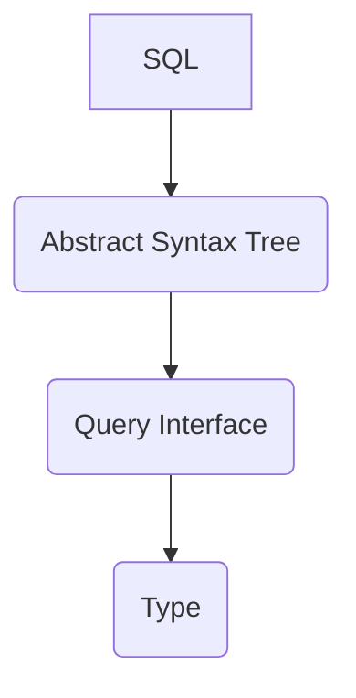

# Potygen (Postgres typescript generator)

Main readme at [Potygen]

## Usage

The main interface to potygen is the `sql` string template literal.

> [examples/sql.ts](https://github.com/ivank/potygen/tree/main/packages/potygen/examples/sql.ts)

```ts
import { sql } from '@potygen/potygen';
import { Client } from 'pg';

const db = new Client(process.env.POSTGRES_CONNECTION);

async function main() {
  await db.connect();
  const productsQuery = sql`SELECT product FROM orders WHERE region = $region`;
  const data = await productsQuery(db, { region: 'Sofia' });

  console.log(data);

  await db.end();
}

main();
```

This is paird with [@potygen/cli](../cli) to generate types for statically typed queries.

You can also get the raw query config object that would be passed to [pg](https://github.com/brianc/node-postgres) query call.

> [examples/sql-query.ts](https://github.com/ivank/potygen/tree/main/packages/potygen/examples/sql-query.ts)

```ts
import { sql, toQueryConfig } from '@potygen/potygen';

const productsQuery = sql`SELECT product FROM orders WHERE region = $region`;
const queryConfig = toQueryConfig(productsQuery, { region: 'Sofia' });

console.log(queryConfig);
```

## Pipeline



SQL is processed through several stages.

### SQL -> AST

With the `parse` function we process a raw sql into an abstract syntax tree (AST) that is used throughout the various components.

All of the tokens are numbers, to make sence of them you'll need to reference [SqlName](src/grammar.types.ts#L)

> [examples/parser.ts](https://github.com/ivank/potygen/tree/main/packages/potygen/examples/parser.ts)

```ts
import { parser } from '@potygen/potygen';

const sql = `SELECT * FROM users`;
const { ast } = parser(sql);

console.log(ast);
```

The AST is later used by [@potygen/prettier-plugin-pgsql](../prettier-plugin-pgsql), [@potygen/typescript-pgsql-plugin](../typescript-pgsql-plugin) as well as the typescript generation from [@potygen/cli](../cli)

### AST -> Query Interface

Using the AST we can create an "interface" for a specific SQL, mainly what parameters are required by it an the type of its response. If the types can be determined statically, they will.

> [examples/static-query-interface.ts](https://github.com/ivank/potygen/tree/main/packages/potygen/examples/static-query-interface.ts)

```ts
import { parser, toQueryInterface } from '@potygen/potygen';

const sql = `SELECT 123 as "col1"`;
const { ast } = parser(sql);
const queryInterface = toQueryInterface(ast);

console.log(queryInterface.results);
```

If types require data to be loaded, then a plan (Load Type) will be returned instead. This will later be used to construct queries to get the data from postgres.

> [examples/load-query-interface.ts](https://github.com/ivank/potygen/tree/main/packages/potygen/examples/load-query-interface.ts)

```ts
import { parser, toQueryInterface } from '@potygen/potygen';

const sql = `SELECT name FROM users WHERE email = $email`;
const { ast } = parser(sql);
const queryInterface = toQueryInterface(ast);

console.log(JSON.stringify(queryInterface, null, 2));
```

### Query Interface -> Type

With `loadQueryInterfacesData` you can load the data, required to generate the types for a given query. Since this could be done in bulk, or incrementally, by keeping an reusing loaded data, its a separate function.

> [examples/load.ts](https://github.com/ivank/potygen/tree/main/packages/potygen/examples/load.ts)

```ts
import {
  parser,
  toQueryInterface,
  loadQueryInterfacesData,
  toLoadedQueryInterface,
  LoadedData,
} from '@potygen/potygen';
import { Client } from 'pg';

/**
 * Log all operation details to the console
 */
const logger = console;
const db = new Client(process.env.POSTGRES_CONNECTION);
const context = { db, logger };

/**
 * A reusable cache of already laoded data
 */
let loadedData: LoadedData[] = [];

async function main() {
  await db.connect();
  const sql = `SELECT product FROM orders WHERE region = $region`;
  const { ast } = parser(sql);
  const queryInterface = toQueryInterface(ast);

  /**
   * If the data is already present in loadedData, it will not be loaded again
   */
  loadedData = await loadQueryInterfacesData(context, [queryInterface], loadedData);

  const loadedQueryInterface = toLoadedQueryInterface(loadedData)(queryInterface);

  console.log(JSON.stringify(loadedQueryInterface, null, 2));

  await db.end();
}

main();
```

The `loadedQueryInterface` will hold only statically defined type, that can be then used for various typescript generation purposes, or anything else.

Since the type data required for most database is not that big, we can actually load all of it once, and then be able to resolve the types of any query, as long as the tables / other resources of that table have not been altered.

> [examples/load-all.ts](https://github.com/ivank/potygen/tree/main/packages/potygen/examples/load-all.ts)

```ts
import { parser, toQueryInterface, toLoadedQueryInterface, LoadedData, loadAllData } from '@potygen/potygen';
import { Client } from 'pg';

/**
 * Log all operation details to the console
 */
const logger = console;
const db = new Client(process.env.POSTGRES_CONNECTION);
const context = { db, logger };

/**
 * A reusable cache of already laoded data
 */
let loadedData: LoadedData[] = [];

async function main() {
  await db.connect();

  /**
   * Load _all_ data from the given database, all the table, view, type, enum and function data.
   */
  loadedData = await loadAllData(context, loadedData);

  const sql = `SELECT product FROM orders WHERE region = $region`;
  const { ast } = parser(sql);
  const queryInterface = toQueryInterface(ast);
  const loadedQueryInterface = toLoadedQueryInterface(loadedData)(queryInterface);

  console.log(JSON.stringify(loadedQueryInterface, null, 2));

  await db.end();
}

main();
```

## Inspect

Potygen also includes logic for inspecting and auto-compliting queries that is used in typescript language extensions.

> [examples/inspect.ts](https://github.com/ivank/potygen/tree/main/packages/potygen/examples/inspect.ts)

```ts
import { toInfoContext, loadAllData, completionAtOffset, quickInfoAtOffset } from '@potygen/potygen';
import { Client } from 'pg';

/**
 * Log all operation details to the console
 */
const logger = console;
const db = new Client(process.env.POSTGRES_CONNECTION);
const context = { db, logger };

async function main() {
  await db.connect();

  const data = await loadAllData(context, []);
  const infoContext = toInfoContext(data, logger);

  const sql = `SELECT product FROM orders WHERE region = $region`;
  //                   ^

  const completion = completionAtOffset(infoContext, sql, 7);
  console.log(JSON.stringify(completion, null, 2));

  const quickInfo = quickInfoAtOffset(infoContext, sql, 7);
  console.log(JSON.stringify(quickInfo, null, 2));

  await db.end();
}

main();
```
